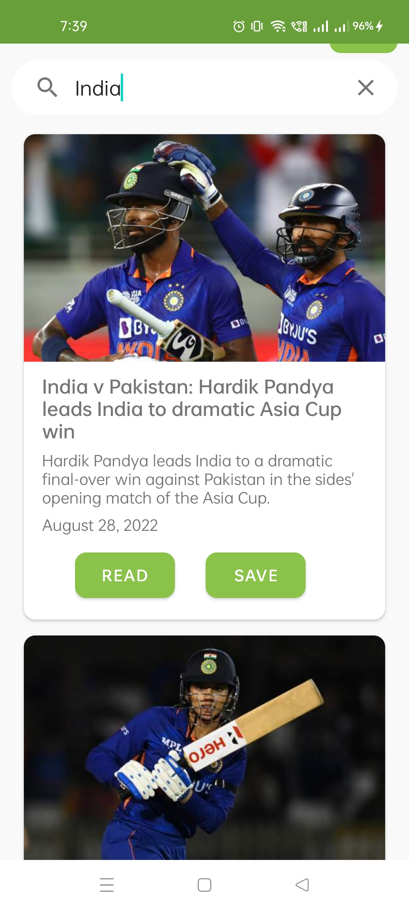
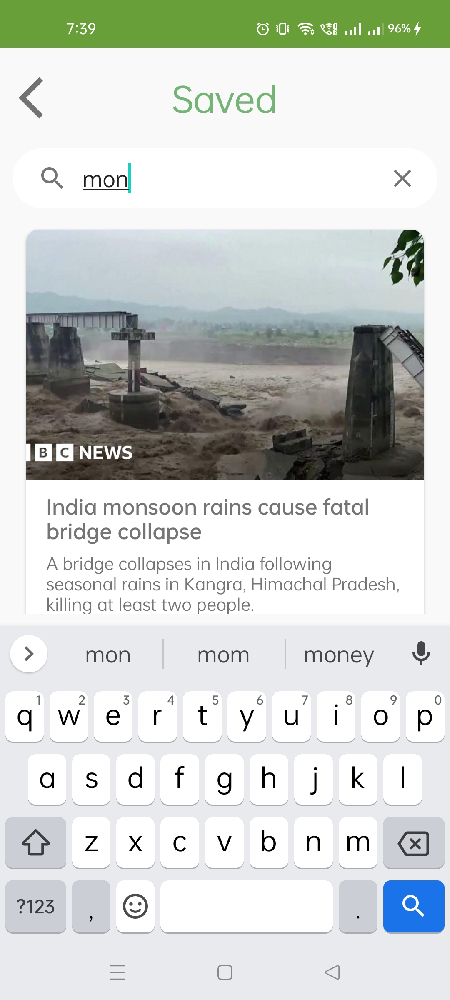

<h2 align="center">NewsBreeze</h2>
<p align="center">
NewsBreeze is a news application that selects latest and best news from Newsapi.org and summarises them to present in a short-summarized format. News is sourced from various categories and various sources, making sure that you always get the best.

### Features
- **Bookmarks**- Save news when you dont't have time to read so that you can come back to them later.
- **Search**    -  The latest news list has a search by title feature. Search lets you find any news by simply typing in a keyword in the search box. Easy access to your favorite topics of intrest via the search option.
- **Read full article**- If you need full story of an article just click on the more button then you will be redirected to the source url.
- **MVVM** with Android Architecture Components(Room, LiveData, ViewModel)

### Permissions
- **Internet connectivity** - This application needs internet connectivity to retrive data from newsapi.org.

### Libraries Used
- [Retrofit](http://square.github.io/retrofit/) For sending network requests and parsing JSON data.
- [Picasso](https://square.github.io/picasso/) Loading and caching images.
- [Room](https://developer.android.com/jetpack/androidx/releases/room?gclid=Cj0KCQjw7KqZBhCBARIsAI-fTKJygUHRpWjxKnKZ4bx-jRwy6rAsorbNIqBtrxgIJ_iN8wV5bl_Wk1gaAqwLEALw_wcB&gclsrc=aw.ds) is a database layer on top of an SQLite database.
- [Livedata](https://developer.android.com/topic/libraries/architecture/livedata) for easier implementation of MVVM architecture.
- [Gson](https://github.com/google/gson) to convert json string to their respective kotlin objects

### Installation Guide

Clone the repository and import into Android Studio

```bash
https://github.com/Arpit-Jha/NewsBreeze.git
```

For a quick installation download the [apk](apk/app-debug.apk)

### Architecture


- **View** - Activity/Fragment with UI-specific logics only.
- **ViewModel** - It keeps the logic away from View layer, provides data streams for UI and handle user interactions. It servers as a link between the Model and the View.
- **Model** - This layer is responsible for the abstraction of the data sources. Model and ViewModel work together to get and save the data.
- **Repository** -The repository is a mediator between the different data sources. ViewModel simply request data from the repository.

### Preview

  
  
